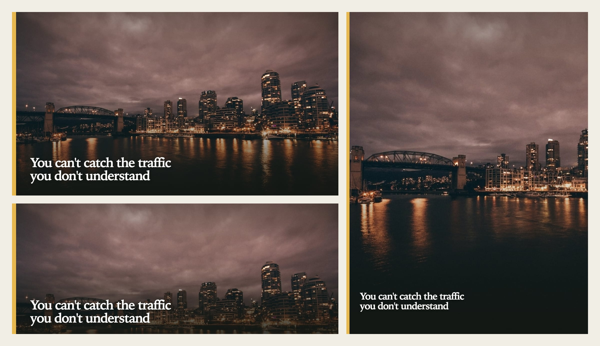

<p align="center"></p>

<h1 align="center">IlloAI</h1>

<p align="center"><b>Write the post. The cover comes free.</b></p>

<p align="center">
  <a href="https://liustack.dev/tools/illoai">liustack.dev</a> ·
  <a href="./README.zh-CN.md">简体中文</a> ·
  <a href="./skills/illoai/SKILL.md">Agent skill</a>
</p>

<p align="center">
  <a href="https://x.com/liustack"></a>
  <a href="https://www.npmjs.com/package/@liustack/illoai"></a>
  <a href="https://nodejs.org"></a>
  <a href="LICENSE"></a>
  
</p>

## Install

```bash
npx -y skills add liustack/illoai -g
```

Works with Claude Code, Codex, and any agent that reads a skill folder. Then tell it: "make a cover for this post."

## Talk to us

Issues are welcome any time. [Open one](https://github.com/liustack/illoai/issues/new), or follow **[@liustack](https://x.com/liustack)** on X. Show the covers you made and tell us what the next release should fix. New releases land there first.

## Highlights

**🖼️ One sentence, one cover.** Your agent finds a photo you can use for free, lays the post's headline and palette over it, and renders a PNG on your machine.

**🆓 Free, and no API key.** Openverse is the default source, and it only returns CC0 and public domain photos, so there is nothing to credit. Add a Pexels key and Pexels goes first.

**📐 One post, every size.** A 16:9 site cover, a 3:4 portrait for social feeds, and a 5:2 banner for X and newsletters, all sharing the project's palette and type.

**🔒 Your draft stays home.** Rendering happens in a local Chromium. The only network calls are the photo search and the photo download.

**🎨 Illustrations if you have a model CLI.** With Codex, Grok, or Claude CLI installed, you can draw body illustrations in ten styles, on your own subscription.

## Commands

Your agent runs these for you. You can also run them yourself:

```bash
npm i -g @liustack/illoai
npx --yes --package @liustack/illoai playwright install chromium

illoai new my-post
illoai stock search "harbour night" --orientation landscape
illoai gen "You can't catch the traffic you don't understand" --source stock --photo openverse:<id> --preset 16:9
```

Install Chromium through the Playwright that ships with illoai. A bare `npx playwright` can pick up an older copy from the npx cache and download a browser that does not match.

`stock search` prints one photo per line: ref, size, license, creator, thumbnail URL. Pick one and pass its ref to `--photo`. `--photo` also takes a local image path.

With a workspace, the photo and its provenance record land in `.illoai/refs/` and the cover lands in `.illoai/out/`. `project.json` holds the project's style and palette, `history.jsonl` records every image, and both are safe to commit.

Without a photo, `--source render` makes a text-only card. With a model CLI, `--source local-model --via codex` draws an illustration in the project style, and `illoai styles` lists all ten.

## Sizes

| Preset | Pixels | Use |
| :-- | :-- | :-- |
| `16:9` | 1600×900 | Site article cover |
| `5:2` | 1600×640 | Newsletter header, X banner, section break |
| `3:2` | 1536×1024 | Body illustration |
| `3:4` | 1242×1656 | Portrait social cover |

When a preset does not fit, set the canvas with `--width`, `--height`, and `--scale`.

## Configuration

```bash
illoai config set stock.pexels.apiKey <key>
illoai config set render.preset 3:4
illoai config show
```

Settings live in `~/.illoai/config.json` with file mode 0600, and `config show` masks every key. The Openverse `stock.openverse.clientId` and `clientSecret` are optional and only raise the rate limit.

## Network and privacy

| Source | What leaves your machine |
| :-- | :-- |
| `stock` | The search words, and the request that downloads the chosen photo |
| `render` | Nothing |
| `local-model` | Goes through your own CLI and subscription. IlloAI never sees it |

Photo downloads connect straight to the image host, over https only, with private addresses blocked and a 40 MB cap per photo. A proxy set only through `HTTPS_PROXY` is not used. Proxies that take over DNS (fake-ip mode) work.

## Diagnosis

```bash
illoai doctor
```

Runs offline and checks the Node.js version, Chromium, config file permissions, and whether `codex`, `grok`, or `claude` is on your PATH.

## Development

```bash
pnpm install
pnpm check
pnpm build
```

## License

MIT
