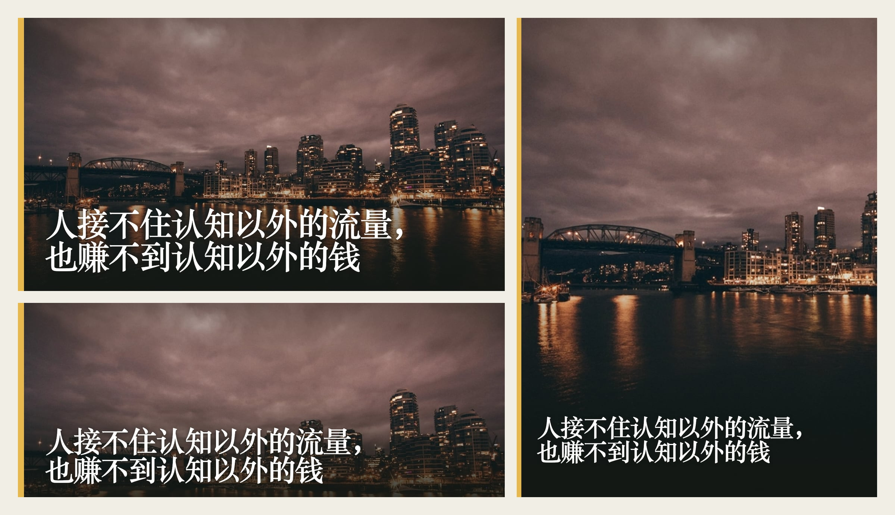

<p align="center"></p>

<h1 align="center">IlloAI</h1>

<p align="center"><b>文章写完，封面顺手就有</b></p>

<p align="center">
  <a href="https://liustack.dev/tools/illoai">liustack.dev</a> ·
  <a href="./README.md">English</a> ·
  <a href="./skills/illoai/SKILL.md">Agent skill</a>
</p>

<p align="center">
  <a href="https://x.com/liustack"></a>
  <a href="https://www.npmjs.com/package/@liustack/illoai"></a>
  <a href="https://nodejs.org"></a>
  <a href="LICENSE"></a>
  
</p>

## 安装

```bash
npx -y skills add liustack/illoai -g
```

装进 Claude Code、Codex，或任何读 skill 文件夹的 agent。装好后跟它说「给这篇文章做个封面」。

## 交流

欢迎随时提 [issue](https://github.com/liustack/illoai/issues/new)。也欢迎在 X 关注 **[@liustack](https://x.com/liustack)**，晒晒你做的封面，说说下一版最该解决什么。新版本会第一时间在那里发。

## 亮点

**🖼️ 一句话出封面。** agent 先搜一张能免费商用的照片，再把这篇文章的标题和配色压上去，在你电脑上渲染成 PNG。

**🆓 不花钱，不用 key。** 默认走 Openverse，只收 CC0 和公有领域的照片，拿来就能用，也不用署名。配了 Pexels key 就优先用 Pexels。

**📐 一篇文章一套尺寸。** 16:9 站内封面、3:4 小红书竖版、5:2 公众号和 X 横幅，配色和字都跟着同一个项目走。

**🔒 稿子不出电脑。** 渲染在本机 Chromium 里完成，联网的只有搜图和下载照片。

**🎨 有模型 CLI 还能出插图。** 装了 Codex、Grok 或 Claude CLI，就能用十种画风画正文插图，花的是你自己的订阅。

## 命令

agent 会替你跑这些命令。想自己动手也行：

```bash
npm i -g @liustack/illoai
npx playwright install chromium

illoai new my-post
illoai stock search "harbour night" --orientation landscape
illoai gen "人接不住认知以外的流量，也赚不到认知以外的钱" --source stock --photo openverse:<id> --preset 16:9
```

`stock search` 每行列一张照片：ref、尺寸、授权、作者、缩略图地址。挑一张，把 ref 交给 `--photo`。`--photo` 也收本地图片路径。

有工作区时，照片和它的来源记录存进 `.illoai/refs/`，封面写到 `.illoai/out/`。`project.json` 记着这个项目的风格和配色，`history.jsonl` 记着每一张图，两个文件都可以提交。

不要照片的话，`--source render` 出纯文字卡片。装了模型 CLI 的话，`--source local-model --via codex` 按项目风格画插图，`illoai styles` 列出十种画风。

## 尺寸

| 预设 | 像素 | 用在哪 |
| :-- | :-- | :-- |
| `16:9` | 1600×900 | 站内文章封面 |
| `5:2` | 1600×640 | 公众号封面、X 横幅、文内过渡条 |
| `3:2` | 1536×1024 | 正文插图 |
| `3:4` | 1242×1656 | 小红书等竖版封面 |

尺寸不够用时，`--width`、`--height`、`--scale` 可以直接指定画布。

## 配置

```bash
illoai config set stock.pexels.apiKey <key>
illoai config set render.preset 3:4
illoai config show
```

配置存在 `~/.illoai/config.json`，文件权限 0600，`config show` 会把所有 key 遮住。Openverse 的 `stock.openverse.clientId` 和 `clientSecret` 可以不填，填了只是提高限额。

## 网络与隐私

| 图源 | 什么会离开你的电脑 |
| :-- | :-- |
| `stock` | 搜索词，以及下载所选照片的请求 |
| `render` | 什么都不出去 |
| `local-model` | 走你自己的 CLI 和订阅，我们不经手 |

照片下载直连图片服务器，只认 https，内网地址一律拦下，单张上限 40MB。只靠 `HTTPS_PROXY` 设的代理用不上，接管 DNS 的代理（fake-ip 模式）可以正常下载。

## 诊断

```bash
illoai doctor
```

不联网，检查 Node.js 版本、Chromium、配置文件权限，以及本机有没有 `codex`、`grok`、`claude`。

## 开发

```bash
pnpm install
pnpm check
pnpm build
```

## License

MIT
